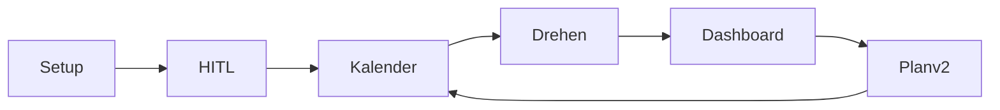

<p align="center">
  <a href="https://claude.ai/code/artifact/d294f9a7-abf0-43ae-a6d3-5c976ca51c6b">
    
  </a>
</p>

<p align="center">
  <a href="https://claude.ai/code/artifact/d294f9a7-abf0-43ae-a6d3-5c976ca51c6b">Pitch Deck</a>
  ·
  <a href="docs/pitchdeck.md">Sprecher-Texte</a>
  ·
  <a href="mockups/">Gamma-Screenshots</a>
</p>

<p align="center">
  
</p>

<p align="center">
  <strong>ContentPilot</strong> — KI-gestützter <strong>30-Tage-Video-Plan</strong> mit Human-in-the-Loop, Kalender, Skripten und geschlossenem Loop zu <strong>Plan v2</strong>.
</p>

<p align="center">
  <a href="https://contentpilot-is89.onrender.com"><strong>Live-Demo</strong></a>
  · Mock-Daten, keine Anmeldung
</p>

<p align="center">
  
  
  
</p>

---

## Was es löst

| | |
|---|---|
| **Chaos** | Fester **30-Tage-Plan** mit Mix **60 / 25 / 15** (Reichweite · Vertrauen · Conversion) |
| **Kontrolle** | **Human in the Loop** — Research, Brainstorm, Freigabe, eigene Monatsideen |
| **Produktion** | Kalender + **Skript-Panel**, Dreh-To-dos, Buffer/Hootsuite-**Import** |
| **Lernen** | Dashboard → Learnings → **Plan v2** (Demo auch **ohne API-Keys**) |



**Menü:** Plan-Setup → HITL → Kalender → Aufnahme-To-dos → Dashboard → Loop

---

## Screenshots

| Kalender & Skript | Dashboard & Loop | Human in the Loop |
|:---:|:---:|:---:|
| [](docs/screenshots/01-kalender.png) | [](docs/screenshots/02-dashboard.png) | [](docs/screenshots/03-human-in-the-loop.png) |

Weitere Bilder: [`docs/screenshots/`](docs/screenshots/) · Gamma-HiDPI: [`mockups/`](mockups/)

---

## Lokal starten

```bash
git clone https://github.com/michazauner1102-spec/contentpilot.git
cd contentpilot && npm install && npm run dev
```

→ **http://localhost:3000** · hängt? → `npm run dev:clean`

| Befehl | Zweck |
|--------|--------|
| `npm run build` | Production |
| `npm run verify:llm` | KI-Pfade testen (`.env.local` + Dev-Server) |
| `npm run demo:video` | 2-Min-Screencast ([`demo/VOICEOVER.md`](demo/VOICEOVER.md)) |

---

## Konfiguration (kurz)

| Modus | Setup |
|--------|--------|
| **Demo (Standard)** | `.env.local.example` kopieren — Mock, keine Keys nötig |
| **Echte KI** | `FORCE_MOCK_ONLY=false` + **ein** LLM-Key (`LLM_PROVIDER` + Anthropic / Gemini / OpenAI) |
| **Web-Research** | optional Firecrawl, Perplexity, Tavily — siehe [`.env.local.example`](.env.local.example) |

Details: [`docs/SECURITY.md`](docs/SECURITY.md) · Deploy: [`render.yaml`](render.yaml) · [](https://render.com/deploy?repo=https://github.com/michazauner1102-spec/contentpilot)

---

## Dokumentation

| Thema | Datei |
|--------|--------|
| Pitch & Q&A (~5 Min.) | [`docs/plattform-erklaeren.md`](docs/plattform-erklaeren.md) |
| 10 Slides (Gamma) | [`docs/pitchdeck.md`](docs/pitchdeck.md) |
| API-Keys & Demo-Sicherheit | [`docs/SECURITY.md`](docs/SECURITY.md) |

---

<p align="center">
  Hackathon <strong>Social Media Stuttgart</strong> ·
  <a href="https://github.com/michazauner1102-spec/contentpilot">GitHub</a> ·
  <a href="https://contentpilot-is89.onrender.com">Live-Demo</a>
</p>
