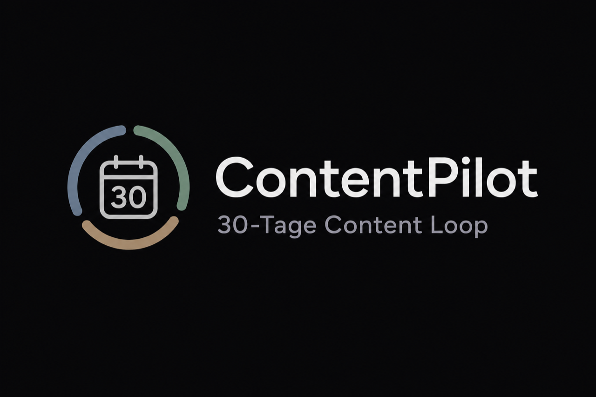
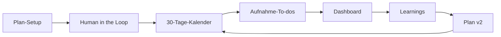
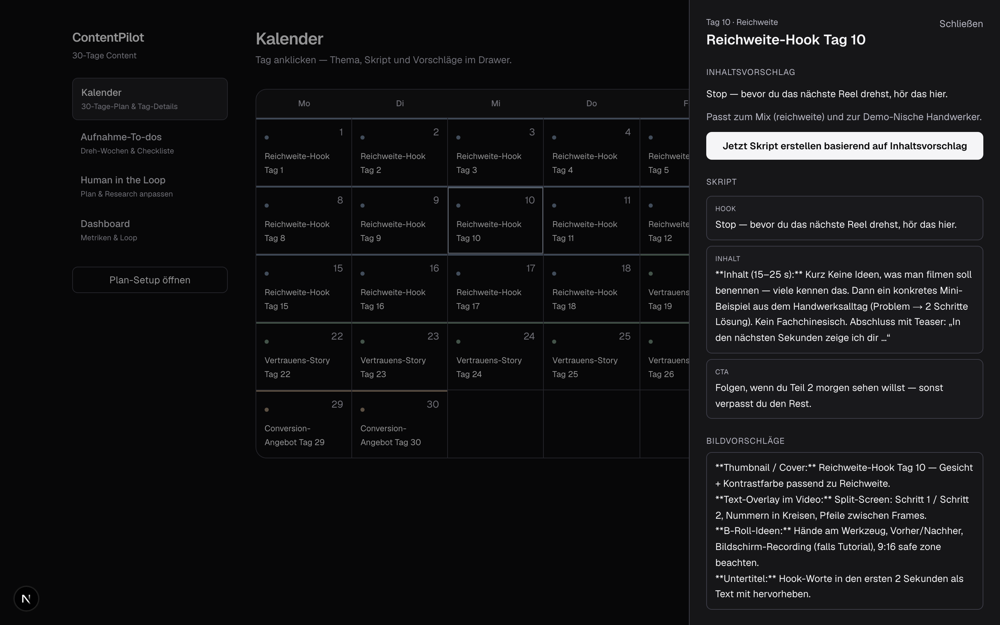
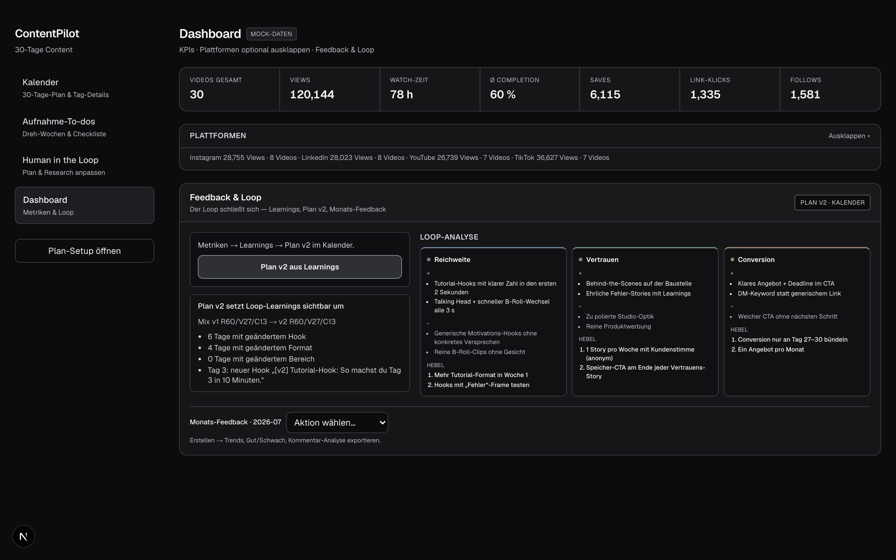
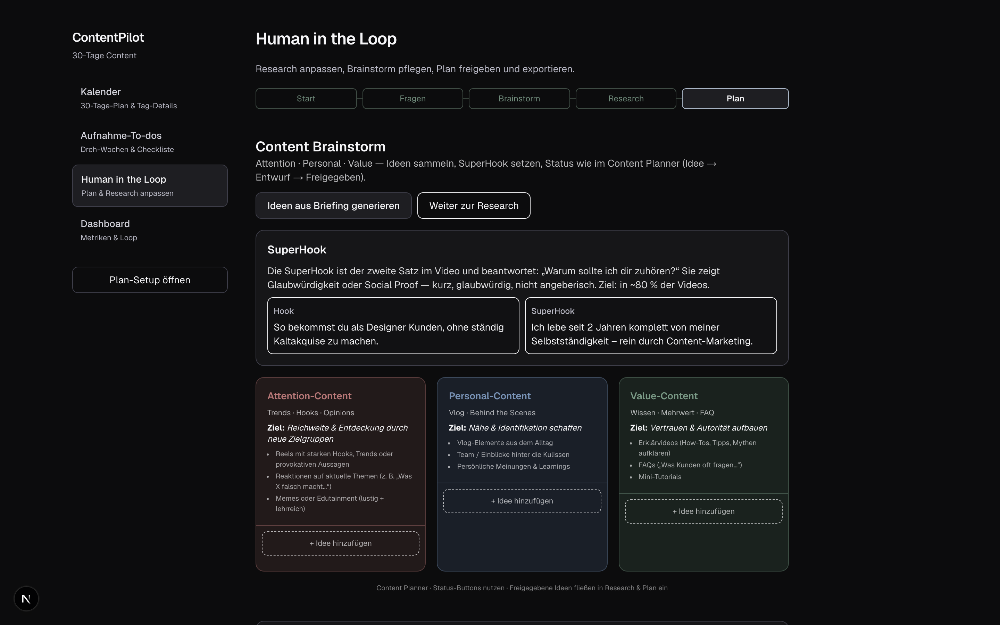
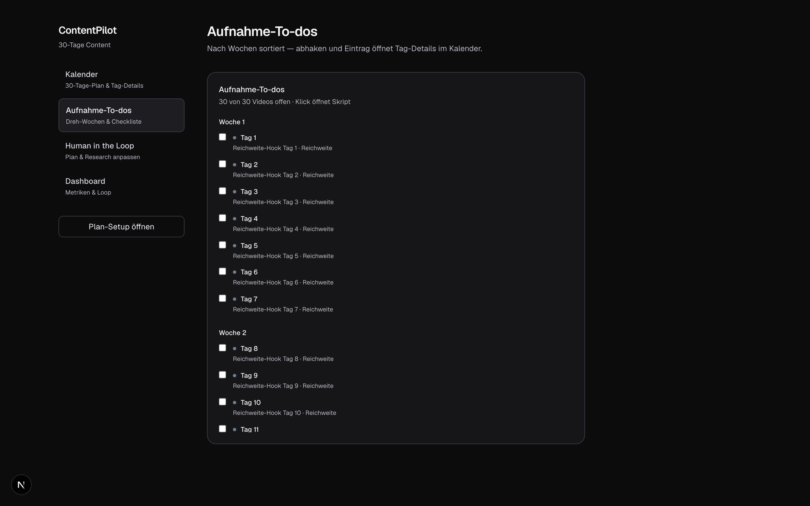
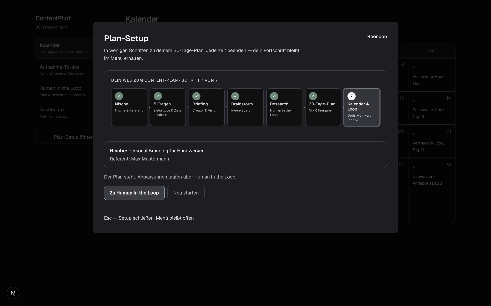

<p align="center">
  
</p>

<p align="center">
  <strong>ContentPilot</strong> — vom Briefing zum 30-Tage-Videoplan, mit Dreh-To-dos, Mock-Performance und geschlossenem Loop zu Plan v2.
</p>

<p align="center">
  <a href="https://contentpilot-is89.onrender.com"><strong>Live-Demo öffnen</strong></a>
  · Mock-Daten · ohne Anmeldung
  · <a href="https://claude.ai/code/artifact/d294f9a7-abf0-43ae-a6d3-5c976ca51c6b">Pitch Deck</a>
  · <a href="mockups/">Gamma-Screenshots</a>
</p>

<p align="center">
  
  
  
  
</p>

---

## Was ist ContentPilot?

MVP für **Creator und Marketing-Teams**, die Social-Video **planbar** machen wollen: Nische schärfen, Research mit Human-in-the-Loop, **30 Tage** im Kalender, Aufnahme strukturieren, Performance simulieren und daraus **Plan v2** ableiten.

> Öffentliche Demo läuft **ohne API-Keys** — Metriken, einzelne Skripte und Learnings nutzen Mock-Daten ([`docs/SECURITY.md`](docs/SECURITY.md)).

---

## Highlights

| | |
|---|---|
| **Plan statt Chaos** | **60 / 25 / 15**-Mix (Reichweite · Vertrauen · Conversion) über 30 Tage |
| **Human in the Loop** | Brainstorm, Research (Web-Provider wählbar), Freigabe, Monatsvorschläge |
| **Kalender** | Mehrere Monats-Tabs, Tag-Detail, **Skript-Panel rechts**, Buffer/Hootsuite-Import |
| **Produktion** | Aufnahme-To-dos nach Dreh-Wochen, Checkliste, Fortschritt |
| **Loop** | Dashboard, Plattform-Reports, Learnings, **Monats-Feedback**, Plan v2 |

---

## Für wen?

| Persona | Nutzen |
|---------|--------|
| **Solo-Creator** | Klare Tagesplanung, Hooks und Dreh-Impulse ohne stundenlanges Grübeln |
| **Social-Media-Manager** | Briefing, Research und Planversionen für Stakeholder |
| **Hackathon / Agentur** | End-to-end: Setup → Plan → KPI → Iteration in einer App |

---

## Ablauf



1. **Plan-Setup** — Nische, Wizard, Briefing, optional Trend-Research  
2. **Human in the Loop** — Brainstorm, Research, Plan freigeben oder CSV/JSON importieren  
3. **Kalender** — Tag öffnen → Inhaltsvorschlag → Skript generieren  
4. **Aufnahme-To-dos** — Dreh-Wochen abhaken  
5. **Dashboard** — KPIs, Feedback & Loop, Testdaten importieren  
6. **Plan v2** — angepasster Folgemonat im Kalender  

Ausführliche Demo-Anleitung: [`docs/plattform-erklaeren.md`](docs/plattform-erklaeren.md)

---

## Screenshots

### Kalender & Skript

<p align="center">
  
</p>

### Dashboard & Loop

<p align="center">
  
</p>

### Human in the Loop · Aufnahme · Plan-Setup

<p align="center">
  
  
  
</p>

Neu erzeugen: `npm run dev` → `npm run screenshots` · HiDPI für Slides: `npm run pitch-screenshots-hd` → [`mockups/`](mockups/)

---

## Schnellstart

```bash
git clone https://github.com/michazauner1102-spec/contentpilot.git
cd contentpilot
npm install
cp .env.local.example .env.local   # optional — Demo nutzt Mock
npm run dev
```

**http://localhost:3000** · Probleme? → `npm run dev:clean` · Port belegt? → `lsof -i :3000`

| Befehl | Beschreibung |
|--------|----------------|
| `npm run build` | Production-Build |
| `npm run verify:llm` | Brainstorm, Research, Trends (mit LLM-Key) |
| `npm run demo:video` | 2-Min-Demo-Video lokal (`demo/video/`) |

---

## Konfiguration

| Modus | Was tun |
|--------|---------|
| **Öffentliche Demo** | `FORCE_MOCK_ONLY=true` (siehe [`render.yaml`](render.yaml)) |
| **Echte KI lokal** | `FORCE_MOCK_ONLY=false` + **ein** LLM: `LLM_PROVIDER` + passender Key |
| **Ohne API-Key (lokal)** | `LLM_PROVIDER=claude-cli` — nutzt die eingeloggte `claude` CLI (Abo), kein Key |

| Provider | Key / Voraussetzung |
|----------|-----|
| Anthropic (Default) | `ANTHROPIC_API_KEY` |
| Claude CLI | `claude` CLI installiert & eingeloggt — **kein Key**, nur lokal (nicht auf Render); `LLM_MODEL=haiku\|sonnet\|opus` |
| Gemini | `GOOGLE_GENERATIVE_AI_API_KEY` / `GEMINI_API_KEY` |
| OpenAI | `OPENAI_API_KEY` |

Web-Research optional (Firecrawl, Perplexity, Tavily): [`.env.local.example`](.env.local.example)

---

## Live-Demo & Deploy

**https://contentpilot-is89.onrender.com** — Render Free Tier (Frankfurt), Cold Start nach Inaktivität möglich.

[](https://render.com/deploy?repo=https://github.com/michazauner1102-spec/contentpilot)

---

## Projekt

```
app/           API Routes (Next.js App Router)
components/    Kalender, Dashboard, HITL, Shell
lib/           Plan-Generator, Insights, LLM, Research, Demo
docs/          Screenshots, Security, Plattform-Erklärung
mockups/       HiDPI-Bilder fürs Pitch Deck
```

Weitere Docs: [`docs/README.md`](docs/README.md)

---

<p align="center">
  Hackathon <strong>Social Media Stuttgart</strong> ·
  <a href="https://github.com/michazauner1102-spec/contentpilot">GitHub</a> ·
  <a href="https://contentpilot-is89.onrender.com">Live-Demo</a>
</p>
