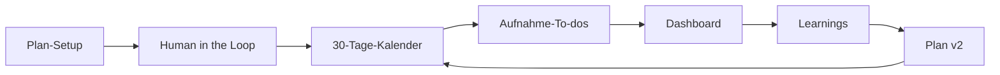

<p align="center">
  
</p>

<p align="center">
  <strong>ContentPilot</strong> — vom Briefing zum 30-Tage-Videoplan, mit Dreh-To-dos, Mock-Performance und geschlossenem Loop zu Plan v2.
</p>

<p align="center">
  
  
  
  
</p>

---

## Was ist ContentPilot?

ContentPilot ist ein **MVP für Creator und Marketing-Teams**, die Social-Video **planbar** machen wollen: Nische schärfen, Research mit Human-in-the-Loop, **30 Tage** im Kalender, Aufnahme strukturieren, Ergebnisse simulieren und daraus den **nächsten Monatsplan** ableiten.

> Demo-fähig auch **ohne API-Keys** — Performance, einzelne Skripte und Learnings nutzen Mock-Daten.

---

## USPs — warum ContentPilot?

| | Unique Selling Point |
|---|---------------------|
| **Plan statt Chaos** | Validierter **60 / 25 / 15**-Mix (Reichweite · Vertrauen · Conversion) über 30 Tage |
| **Human in the Loop** | Brainstorm, Research und Freigabe — KI schlägt vor, **du entscheidest** |
| **Ein Kalender, ein Truth** | Tag anklicken → Thema, Hook, Skript, Grafik, Referenz im Drawer |
| **Produktion mitdenken** | Aufnahme-To-dos nach Dreh-Wochen, Checkliste, Fortschritt |
| **Geschlossener Loop** | Dashboard → Mock-Metriken → Learnings → **Plan v2** im Kalender |
| **Export-ready** | Markdown, TXT, JSON, Notion (optional) |

---

## Für wen?

| Persona | Nutzen |
|---------|--------|
| **Solo-Creator / Handwerker** | Wenig Zeit, klare Tagesplanung und konkrete Dreh-Impulse |
| **Social-Media-Manager** | Briefing, Research-Nachweise und Planversionen für Stakeholder |
| **Agentur / Hackathon-Team** | End-to-end Story: Setup → Plan → KPI → Iteration in einer App |
| **Product Demo** | Mock-Badges, Testdaten-Import, Plattform-Reports ohne Live-APIs |

---

## So funktioniert der Flow



1. **Plan-Setup** — Nische, 5 Fragen, Briefing, optional Trend-Research  
2. **Human in the Loop** — Brainstorm-Board, Research, Plan freigeben  
3. **Kalender** — 30 Tage mit Bereichs-Farben (Reichweite / Vertrauen / Conversion)  
4. **Aufnahme-To-dos** — Wochen fürs Drehen, abhaken was fertig ist  
5. **Dashboard** — KPIs, Plattform-Karussell, Report pro Plattform  
6. **Loop** — Plan v2 aus Learnings, Diff sichtbar im UI  

---

## Screenshots

### 30-Tage-Kalender

Tag anklicken öffnet Skript und Vorschläge im Seiten-Drawer.

<p align="center">
  
</p>

### Dashboard & Loop

KPI-Leiste, scrollbares Plattform-Karussell (ohne sichtbare Scrollbar), Klick → **Großansicht Report**.

<p align="center">
  
</p>

### Human in the Loop

Research, Brainstorm und Freigabe — Setup jederzeit beenden, Menü bleibt nutzbar.

<p align="center">
  
</p>

### Aufnahme-To-dos

Dreh-Wochen und Checkliste, Sprung zurück in den Kalender.

<p align="center">
  
</p>

### Plan-Setup

Wizard mit Schnellauswahl und Trend-Research — Vollbild-Overlay, nicht abgeschnitten.

<p align="center">
  
</p>

*Screenshots neu erzeugen:* `npm run dev` starten, dann `npm run screenshots`.

---

## Schnellstart

```bash
git clone https://github.com/michazauner1102-spec/contentpilot.git
cd contentpilot
npm install
cp .env.local.example .env.local   # Keys eintragen (optional für Mocks)
npm run dev
```

Öffnen: **http://127.0.0.1:3000**

| Befehl | Beschreibung |
|--------|----------------|
| `npm run dev` | Entwicklungsserver |
| `npm run build` | Production-Build |
| `npm start` | Production (z. B. Render) |
| `npm run screenshots` | README-Screenshots unter `docs/screenshots/` |

---

## Umgebungsvariablen

Siehe [`.env.local.example`](.env.local.example). **`.env.local` niemals committen.**

### LLM (einer reicht — per `LLM_PROVIDER` wählen)

| Provider | `LLM_PROVIDER` | API-Key |
|----------|----------------|---------|
| **Anthropic Claude** (Default) | `anthropic` | `ANTHROPIC_API_KEY` |
| **Google Gemini** | `gemini` | `GOOGLE_GENERATIVE_AI_API_KEY` oder `GEMINI_API_KEY` |
| **OpenAI** | `openai` | `OPENAI_API_KEY` |

Optional: `LLM_MODEL` setzen (sonst sinnvoller Default pro Provider).

### Referenz-Videos & Metriken (Plattformen)

| Plattform | Referenzen | Metriken (Live-Vorbereitung) |
|-----------|------------|------------------------------|
| **YouTube** | `YOUTUBE_API_KEY` (Search) | `YOUTUBE_OAUTH_REFRESH_TOKEN` + `INSIGHTS_MODE=live` |
| **Instagram / Meta** | `META_ACCESS_TOKEN` oder `INSTAGRAM_ACCESS_TOKEN` | `INSTAGRAM_BUSINESS_ACCOUNT_ID` |
| **TikTok** | `TIKTOK_CLIENT_KEY` + `TIKTOK_CLIENT_SECRET` | `TIKTOK_ACCESS_TOKEN` |
| **LinkedIn** | `LINKEDIN_ACCESS_TOKEN` | `LINKEDIN_ORGANIZATION_URN` |

- `REFERENCE_PLATFORMS=youtube,instagram,tiktok,linkedin` — welche Quellen für Referenz-Recherche  
- `INSIGHTS_MODE=mock` (Default) — plattformspezifische **Demo-Metriken** im Dashboard  
- `INSIGHTS_MODE=live` — nutzt konfigurierte API-Keys, sonst Mock-Fallback  

### Research & Export

| Variable | Zweck |
|----------|--------|
| `TAVILY_API_KEY` / `PERPLEXITY_API_KEY` | Web-Research |
| `FIRECRAWL_API_KEY` | Trend-Research im Wizard |
| `NOTION_TOKEN` + `NOTION_DATABASE_ID` | Optional: Notion-Sync |

---

## Deployment (Render)

[`render.yaml`](render.yaml) liegt als Blueprint bereit:

1. [Render Dashboard](https://dashboard.render.com) → **New** → **Blueprint**  
2. Repo verbinden → Environment-Variablen setzen  
3. Deploy → öffentliche URL (Free Tier: Cold Start möglich)

---

## Projektstruktur

```
app/                 API Routes & App Router
components/          Kalender, Dashboard, HITL, Shell
lib/                 Typen, Plan-Generator, Insights, Demo
insights-module/     Performance-Kern (→ lib/insights/)
docs/                Banner, Screenshots für README
```

---

## Insights & Export

- Performance-Demo: `InsightsService` / Mock-Import über `/api/performance/import`  
- Export: Markdown, Notizen, JSON, Zwischenablage; optional Notion  

---

## Lizenz & Kontext

Hackathon-Projekt **Social Media Stuttgart** — MVP zur Demonstration des Content-Loops.  
Repository: [github.com/michazauner1102-spec/contentpilot](https://github.com/michazauner1102-spec/contentpilot)
