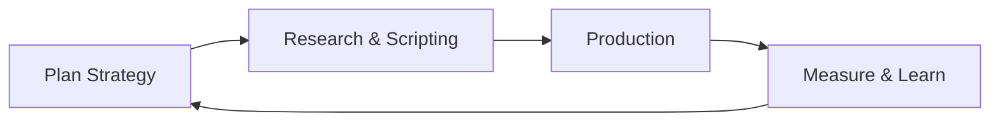

# ContentPilot — Pitch Deck (10 Slides)

Vollständiger Leitfaden für **Gamma** / Präsentation. Entspricht dem Claude-Artifact  
[ContentPilot Pitch Deck](https://claude.ai/code/artifact/d294f9a7-abf0-43ae-a6d3-5c976ca51c6b) (10 Folien).

**Live-Demo:** https://contentpilot-is89.onrender.com  
**Repo:** https://github.com/michazauner1102-spec/contentpilot  
**Screenshots:** [`mockups/`](../mockups/) · Kurz-Demo-Script: [`docs/plattform-erklaeren.md`](plattform-erklaeren.md)

---

## Slide 1 — Titel

**Headline:** CONTENTPILOT  
**Subline:** The AI Content Loop for Everyone.

**Sprecher (DE):**  
ContentPilot ist der Copilot für einen ganzen Social-Video-Monat: von Briefing über 30 geplante Posts bis zu Skript, Dreh und Learnings für den nächsten Plan.

**Optional:** Logo `docs/logo.svg` · Banner `docs/contentpilot-banner.svg`

---

## Slide 2 — The Problem

**Titel:** The problem

**Zwei Säulen (Diagramm):**

| Content Gap | Content Fatigue |
|-------------|-----------------|
| Viele wollen sichtbar sein, haben aber **keinen Plan** — keine Ideen, kein Mix, kein Rhythmus. | Wer postet, **lernt nicht systematisch** — gleiche Formate, keine Auswertung, Burnout durch Dauer-Reaktion statt Strategie. |

**Unten / Mitte:** Pfeile auf „Plan → Produzieren → Messen → Verbessern“ (Loop fehlt heute oft).

**Sprecher:** Solo-Creator und kleine Teams verlieren Zeit zwischen ChatGPT-Ideen, Excel und Scheduling-Tools — ohne geschlossenen Kreis.

---

## Slide 3 — Lösung & Positionierung

**Headline:** ContentPilot is an intelligent planner that closes the loop.

**Links — Kurztext:**

- Briefing + Research (Human in the Loop)
- **30-Tage-Plan** mit validiertem Mix **Reichweite / Vertrauen / Conversion** (60/25/15)
- Kalender, Skripte, Dreh-Wochen, Dashboard, **Plan v2**

**Rechts — Kasten „Social Engineering“ (Merksatz):**

Struktur statt Zufall: KI liefert Tempo und Vorschläge — **du** gibst Research, Freigabe und eigene Monatsideen frei.

**Sprecher:** Nicht „noch ein Chat“, sondern **ein Monats-Operating-System** für Short-Video-Content.

---

## Slide 4 — Step 01 · Plan Strategy

**Header:** 01 · Plan Strategy

**Bullets:**

- Nische + Referenz-Creator + **5 Wizard-Fragen** → Briefing
- Optional: **Trend-Research** (Web: Firecrawl, Perplexity, Tavily oder Gemini/Claude Research)
- KI erzeugt **30 Video-Slots** im Content-Mix

**Visual:** `mockups/01-planungsformular-fragen-2x.png`  
Alternativ README: `docs/screenshots/05-plan-setup.png`

**Sprecher:** In unter zwei Minuten steht ein strategischer Monatsplan — nicht nur eine Ideenliste.

---

## Slide 5 — Step 02 · Research & Scripting

**Header:** 02 · Research & Scripting

**Bullets:**

- **Human in the Loop:** Brainstorm, Research-Fokus, Feedback-Zyklen, Freigabe
- **Web-Recherche wählbar** (Auto-Kette oder fester Provider)
- Kalender-Tag: Inhaltsvorschlag → **Skript-Panel** (Hook, Body, CTA, Bildideen)
- Import **Buffer / Hootsuite** (CSV/JSON) ersetzt Plan, Skript & Loop bleiben in ContentPilot

**Visual:** `mockups/02-kalender-tag-detail-2x.png` · `docs/screenshots/03-human-in-the-loop.png`

**Sprecher:** Research ist steuerbar; Skripte entstehen **pro Tag** aus dem Plan — nicht losgelöst.

---

## Slide 6 — Step 03 · Production Engineering

**Header:** 03 · Production Engineering

**Bullets:**

- **Aufnahme-To-dos** nach Dreh-Wochen, Checklisten, Fortschritt
- Mehrere **Monats-Kalender** (Tabs, Folgemonat, Plan v2)
- Export Markdown / JSON; optional Notion

**Visual:** `docs/screenshots/04-aufnahme-todos.png` · `docs/screenshots/01-kalender.png`

**Sprecher:** Produktion ist mitgedacht — nicht nur „Was poste ich?“, sondern **wann drehe ich?**

---

## Slide 7 — Structure and Flow

**Titel:** Structure and Flow

**Diagramm (Mitte — Raute / Loop):**

**Menü-Merksatz (App):** Setup → HITL → Kalender → Drehen → Dashboard → Loop

| Bereich | Rolle |
|---------|--------|
| Plan-Setup | Briefing, Wizard |
| Human in the Loop | Research, Freigabe, Monatsvorschläge, Import |
| Kalender | 30 Tage, Tag-Detail, Skript |
| Aufnahme-To-dos | Dreh & Haken |
| Dashboard | KPIs, Monats-Feedback, Plan v2 |

**Sprecher:** Alles hängt an **einem** Flow — das ist der „Content Loop“.

---

## Slide 8 — Why Now?

**Titel:** Why Now?

**Venn / zwei Kreise:**

- **AI Capabilities** — LLMs, Web-Research, Skripte in Minuten
- **User Needs** — Creator Economy, Short Video, wenig Zeit, mehr Druck auf Sichtbarkeit
- **Schnittmenge:** Planbare KI + menschliche Freigabe = genau ContentPilot

**Tech-Hinweis (klein):** Für echte KI lokal reicht **ein** LLM-Key (`LLM_PROVIDER` + ein Key); Web-Research optional. Öffentliche Demo: **Mock ohne Keys**.

---

## Slide 9 — User Evolution

**Headline:** ContentPilot turns casual beginners into strategic directors.

**Drei Stufen:**

| Stufe | Verhalten | ContentPilot |
|-------|-----------|--------------|
| **Entry Level** | Sporadisch posten, unsicher | Wizard + Plan + Trends |
| **AI Creator** | Nutzt KI, braucht Struktur | HITL, Skripte, Kalender |
| **Strategic Director** | Iteriert datenbasiert | Dashboard, Learnings, **Plan v2**, Monatsvorschläge |

**Sprecher:** Das Tool wächst mit — vom ersten Monat bis zur strategischen Schleife.

---

## Slide 10 — Abschluss

**Headline:** The AI Content Loop for Everyone.

**Links:** Kurz recap — Plan · Script · Shoot · Measure · Next Month

**Rechts:** **QR-Code** → https://contentpilot-is89.onrender.com

**CTA:** Repo starren / Demo öffnen / Hackathon-Jury: End-to-end MVP in einer App

**Abschluss-Satz (DE):**  
„ContentPilot ist der **Copilot für den Content-Monat** — KI liefert Tempo, du die Kontrolle, der Loop liefert den nächsten Plan.“

---

## Mockup-Zuordnung (Gamma)

| Slide | Empfohlenes Bild |
|-------|------------------|
| 4 Plan Strategy | `mockups/01-planungsformular-fragen-2x.png` |
| 5 Research & Scripting | `mockups/02-kalender-tag-detail-2x.png` |
| 6 Production | `docs/screenshots/04-aufnahme-todos.png` |
| Loop / Dashboard | `mockups/03-feedback-learnings-planv2-2x.png` · `docs/screenshots/02-dashboard.png` |

Neu rendern: `npm run dev` → `npm run pitch-screenshots-hd`

---

## Demo in 2 Minuten (Jury)

1. Plan-Setup (Nische + 1 Wizard-Frage)  
2. HITL — Research-Provider zeigen, Plan freigeben  
3. Kalender — Tag → Skript rechts  
4. Dashboard — Learnings → Plan v2  

Details: [`demo/VOICEOVER.md`](../demo/VOICEOVER.md) · Video: `npm run demo:video`
